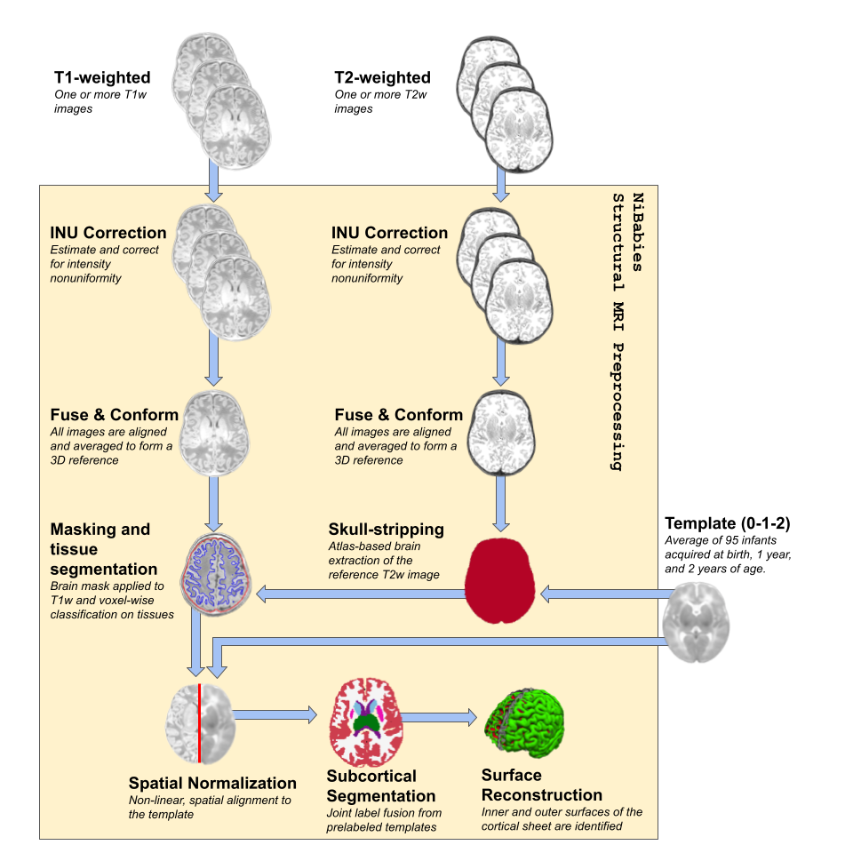
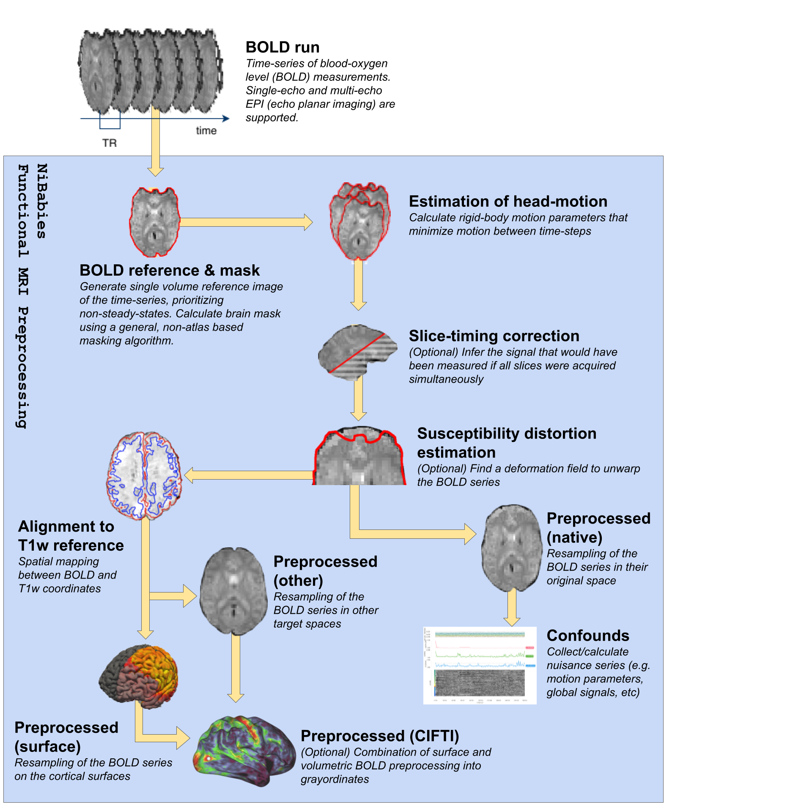

# *NiBabies*: A robust preprocessing workflow tailored for neonate and infant MRI

Anatomical | Functional
---------- | ----------
 | 

*NiBabies* is an open-source software pipeline designed to process anatomical and functional magnetic resonance imaging data.
A member of the [NeuroImaging PREProcessing toolS (NiPreps)](https://www.nipreps.org/) family, *NiBabies* is designed and optimized for human infants between 0-2 years old.

---

## Getting Started

For comprehensive information on *NiBabies*, including installation and usage, visit [our documentation](https://nibabies.readthedocs.io/en/latest).
