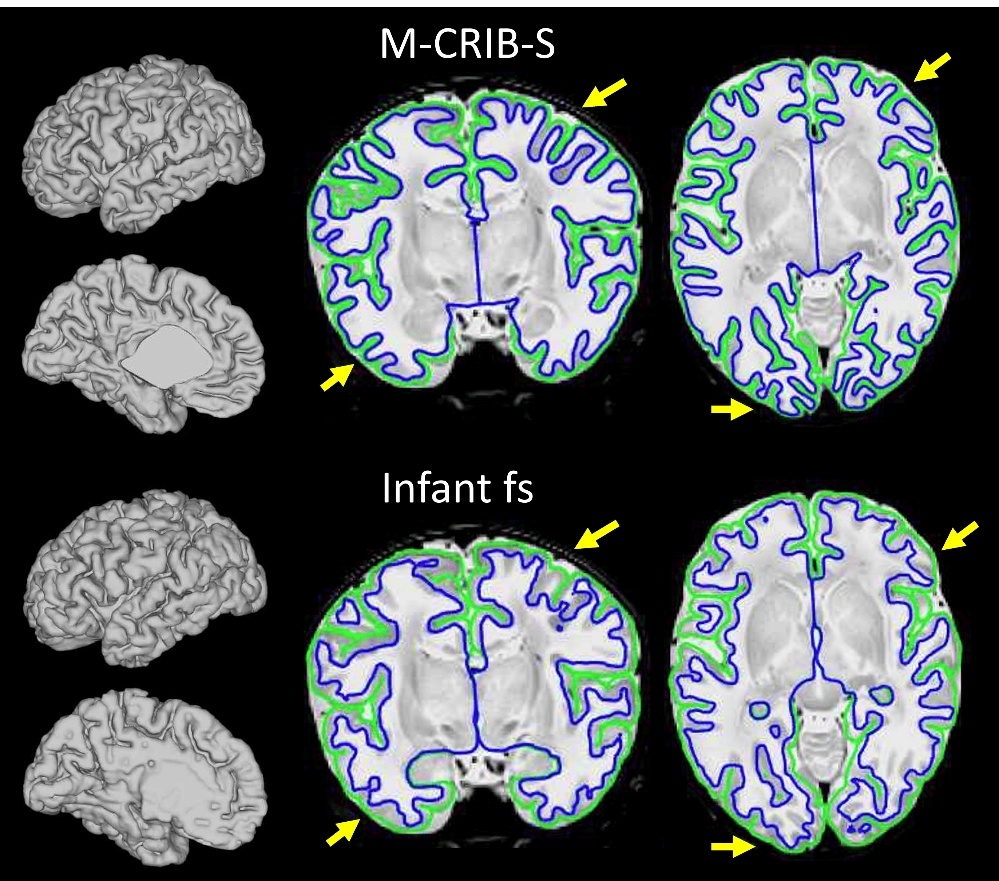
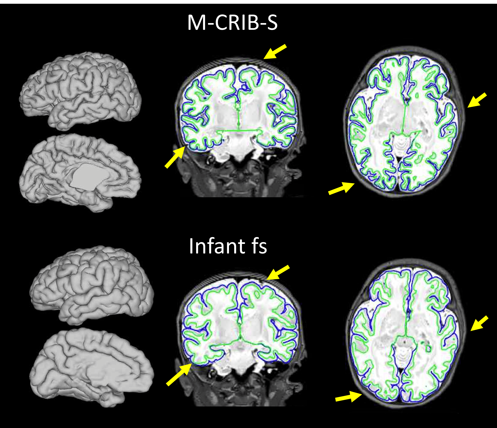
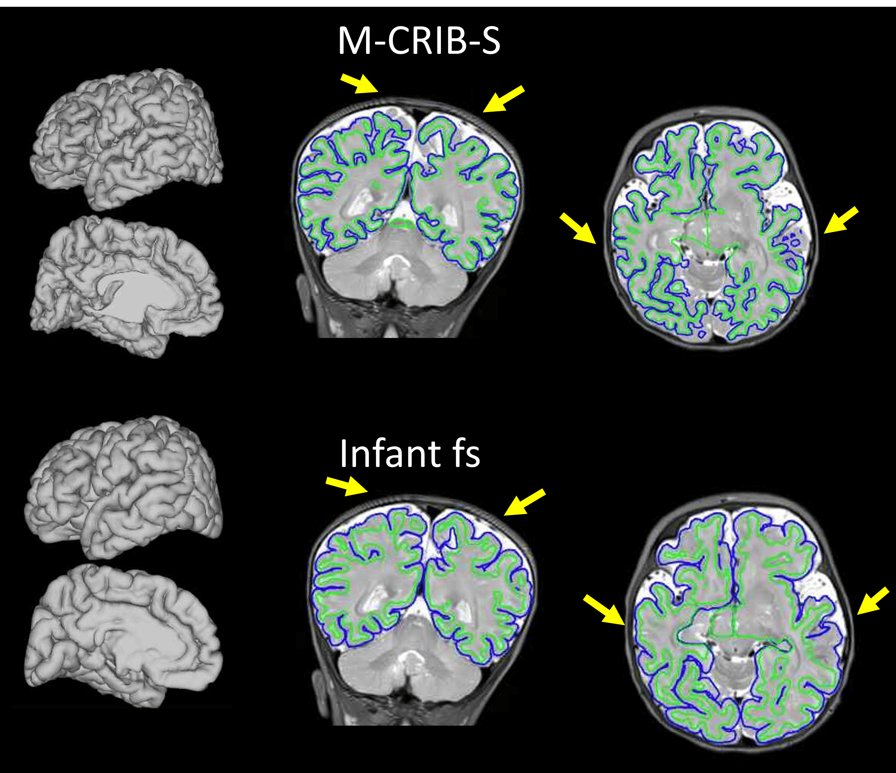
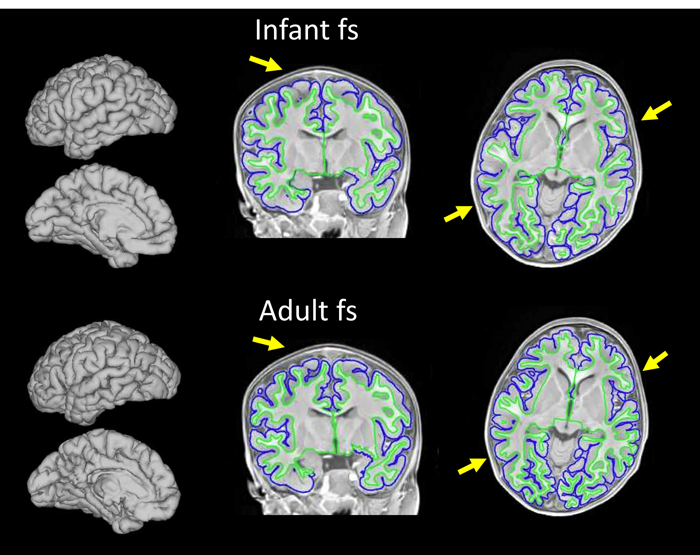
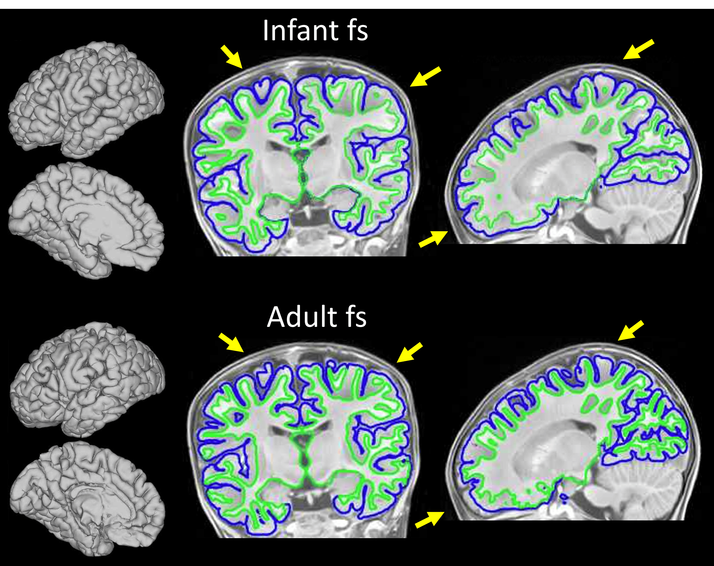
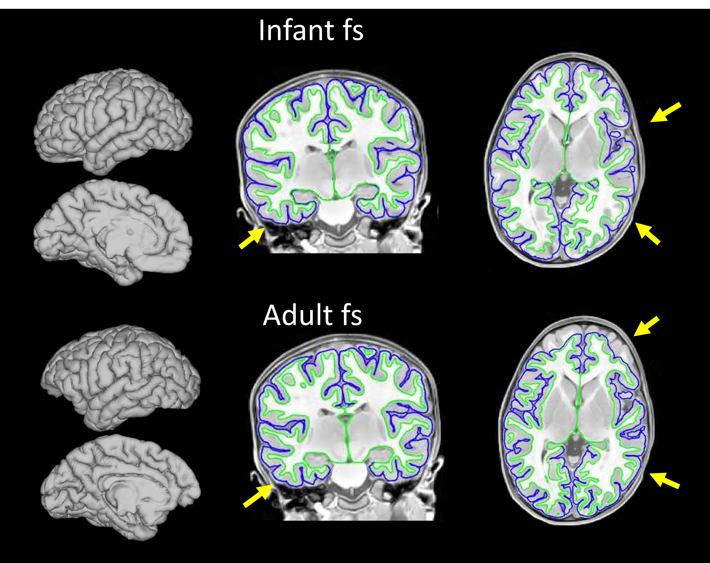

## Surface Comparison

To determine the `auto` ranges used in surface reconstruction, various participant ages were compared across the different methods.
These comparisons vary across surface reconstruction method, age (chronological) and reference anatomical modality (T1w / T2w).

:::{note}
For these comparisons, BIBSNet was used to precompute anatomical masks and segmentations for all M-CRIB-S and InfantFS runs.
At the time of comparison, AdultFS (FreeSurfer recon-all) did not allow precomputed derivatives.
:::

###  1 month (M-CRIB-S and InfantFS)

Processed T2w image - white matter surface shows more detail with M-CRIB-S while InfantFS misses the delineation of some smaller gyri (see arrows).
M-CRIB-S is optimized for T2 based surface reconstruction at very young ages and is the preferred method in this case.

### 2 month (M-CRIB-S and InfantFS)

Processed T2w image - white matter surface shows more detail with M-CRIB-S while InfantFS misses the delineation of some smaller gyri (see arrows).
M-CRIB-S is optimized for T2 based surface reconstruction at very young ages and is the preferred method in this case.

### 5 month (M-CRIB-S and InfantFS)

Processed T2w image - The M-CRIB-S reconstructed surface is missing several gyri (see arrows) while the Infant fs reconstructed surface more appropriately captures the brain.
While the InfantFS version can be judged as a usable surface, some small details get lost that are present in the M-CRIB-S version (see arrows), which leave room for improvement.

### 15 month (InfantFS and AdultFS)

Processed T1w image - white matter surface shows more detail in some areas with Freesurfer recon-all however in this example (see arrows), with only very minimal gray matter cutoffs from the Freesurfer based brain masking.
Even though this participant is not the default age range for using adult Freesurfer recon-all, outcomes are slightly superior.

### 17 month (InfantFS and AdultFS)

Processed T1w image - white matter surface shows more detail in some areas with FreeSurfer recon-all however in this example, the Freesurfer based brain masking leads to gray matter cutoffs, which makes the surface created by Infant fs preferable.

### 32 month (InfantFS and AdultFS)

Processed T1w image - Even though the infant in this example is in the default age range for using FreeSurfer recon-all, the Freesurfer based brain masking leads to big cutoffs, making this surface unusable and the Infant fs output preferred.
Apart from that, white matter surface shows more detail in some areas with FreeSurfer recon-all (see arrows).
