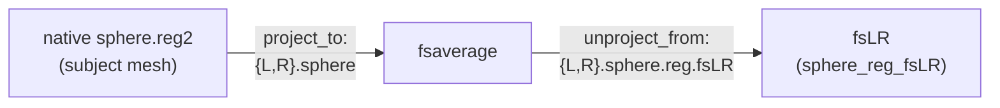

# M-CRIB-S fsaverage → fsLR registration spheres

Bundled from M-CRIB-S's `lib/fsaverage`; used by
`nibabies.workflows.anatomical.surfaces.init_mcribs_fsLR_reg_wf` to register
M-CRIB-S native surfaces to fsLR.

## Files

| File | Frame | Role in `SurfaceSphereProjectUnproject` |
|---|---|---|
| `{L,R}.sphere.surf.gii` | fsaverage | `sphere_project_to` |
| `{L,R}.sphere.reg.fsLR.surf.gii` | fsLR | `sphere_unproject_from` |

- `{L,R}.sphere.surf.gii` — M-CRIB-S's fsaverage sphere (`lib/fsaverage/?h.sphere`),
  ico6 / 40,962 vertices.
- `{L,R}.sphere.reg.fsLR.surf.gii` — that same mesh deformed into fsLR coordinates
  (`lib/fsaverage/?h.sphere.reg.fslr32k`): M-CRIB-S's own fsaverage→fs_LR_32k
  registration.

Converted from FreeSurfer binary to GIFTI (geometry unchanged);
`AnatomicalStructurePrimary` metadata set for Connectome Workbench.

## Registration flow

## Why bundle both rather than reuse TemplateFlow's fsaverage

smriprep's `init_fsLR_reg_wf` (used for FreeSurfer / Infant FreeSurfer) fills these
slots with HCP `fs_L`/`fs_R` surfaces, which do not work for M-CRIB-S:

- The **fsaverage→fsLR registration** is a genuinely different mapping, not a
  re-resolution of the HCP one. M-CRIB-S registers its surfaces (`sphere.reg2`) to its
  own neonatal template and ships an fsaverage→fsLR registration calibrated to that.
  This file is the reason for bundling.
- The **fsaverage sphere** is needed as the matched `project_to` for that deformation:
  `project_to` and `unproject_from` must share a vertex ordering, and the deformation
  carries M-CRIB-S's.

### Can the fsaverage sphere come from TemplateFlow instead?

Not cleanly. TemplateFlow's `den-41k` is FreeSurfer's standalone `fsaverage6`, whereas
M-CRIB-S's `lib/fsaverage` is derived from the full `fsaverage` (ico7). FreeSurfer
spherizes those two subjects independently, so although both are ico6 (same 40,962
vertices and topology) their spherical coordinates differ (NN ~0.4° median; the
nearest-neighbor map is only ~86% one-to-one) — it is not a pure reordering. The
deformation can be *approximately* remapped onto TemplateFlow's
fsaverage by nearest neighbor (it reproduces the result to within a handful of
vertices), but that introduces a sub-degree resampling error for no real benefit.
Bundling M-CRIB-S's own matched pair keeps the registration exact and self-consistent.

## Provenance

- Source: M-CRIB-S — <https://github.com/DevelopmentalImagingMCRI/MCRIBS>:
  - `lib/fsaverage/{lh,rh}.sphere` — added in commit
    [`e0daec6`](https://github.com/DevelopmentalImagingMCRI/MCRIBS/commit/e0daec6d0798659c54eeea6c2bb2e440ca3de089).
  - `lib/fsaverage/{lh,rh}.sphere.reg.fslr32k` — added in commit
    [`482d9f7`](https://github.com/DevelopmentalImagingMCRI/MCRIBS/commit/482d9f79d16803e73e8d45eb265e103951d52bd0).
